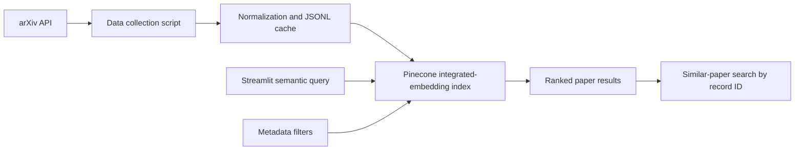

# Architecture

This project demonstrates a compact vector database workflow for AI/ML research paper discovery.

## Implementation Plan

1. Collect recent AI/ML metadata from arXiv categories `cs.AI`, `cs.LG`, `cs.CL`, and `cs.CV`.
2. Normalize paper records and cache them as JSONL for repeatable development.
3. Create or connect to a Pinecone serverless index with integrated embedding.
4. Upsert text records containing title and abstract plus filterable metadata.
5. Search with natural-language text, optional metadata filters, and similar-paper lookup.
6. Evaluate latency, category proxy metrics, filter correctness, and optional human labels.

## Runtime Flow

The scripts download and ingest data before the Streamlit app is launched. The app uses the same project service layer as the evaluation script, so searches and filters are exercised consistently across the UI, tests, and metrics.

